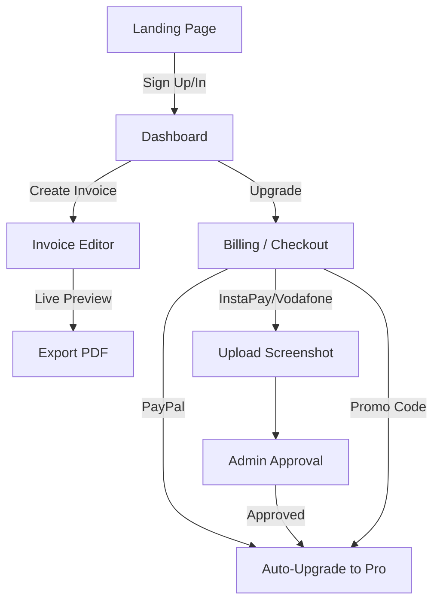

## 1. Product Overview
Quick Invoice Generator is a production-ready SaaS web application optimized for freelancers, especially in Egypt, allowing them to create professional invoices in under 30 seconds.
- Main purposes: Solve the problem of slow, complex invoice generation and facilitate local payments (InstaPay, Vodafone Cash) for Egyptian freelancers.
- Target value: A highly optimized, beautifully designed, and simple-to-use monetization platform with free and pro tiers, complete with an admin panel and promo code system.

## 2. Core Features

### 2.1 User Roles
| Role | Registration Method | Core Permissions |
|------|---------------------|------------------|
| Guest | None | View landing page |
| Free User | Email / Google Auth | Create up to 5 invoices/month (watermarked), basic templates |
| Pro User | Paid Subscription / Promo Code | Unlimited invoices, no watermark, premium templates, custom branding |
| Admin | System predefined | Manage users, approve manual payments, manage promo codes, view analytics |

### 2.2 Feature Module
1. **Landing Page**: Hero section, Features, Pricing, How it works, CTA.
2. **Dashboard**: List invoices, search, duplicate, edit, delete.
3. **Invoice Editor**: Ultra-fast creation, live preview, auto-calculations.
4. **Branding Settings**: Upload logo, choose color, save brand settings.
5. **Billing & Checkout**: PayPal integration, InstaPay/Vodafone Cash manual flow with screenshot upload.
6. **Admin Panel**: Users management, manual payment approvals, promo code generation and tracking.

### 2.3 Page Details
| Page Name | Module Name | Feature description |
|-----------|-------------|---------------------|
| Landing | Hero & Pricing | Clear value proposition, pricing tiers (Free, Pro, Lifetime). |
| Dashboard | Invoice List | Grid/List of past invoices with status, search bar, duplicate/edit/delete actions. |
| Editor | Form & Preview | Two-pane layout: form on the left (client info, items, taxes, notes), live preview on the right. |
| Settings | Brand & Billing | Logo upload, color picker, subscription status, promo code redemption. |
| Checkout | Payment Methods | Select PayPal (auto) or InstaPay/Vodafone Cash (manual screenshot upload). |
| Admin | Approvals & Codes | View pending screenshots to approve/reject; generate and track promo codes. |

## 3. Core Process
1. User signs up via Email/Google.
2. User goes to Dashboard and clicks "New Invoice".
3. User fills out the invoice details in the Editor (under 30 seconds) and sees a live preview.
4. User exports the invoice as a high-quality PDF.
5. If user exceeds 5 invoices/month or wants premium features, they go to Billing.
6. User selects a payment method (e.g., InstaPay) and uploads a screenshot.
7. Admin approves the payment in the Admin Panel, upgrading the user to Pro.

## 4. User Interface Design
### 4.1 Design Style
- **Primary Color**: Modern Indigo or Emerald (trust and finance), clean white backgrounds.
- **Secondary Colors**: Slate grays for text, subtle borders.
- **Button Style**: Slightly rounded (radius-md), modern solid colors with subtle hover effects.
- **Font**: Inter or Plus Jakarta Sans for a clean, professional, and highly legible look.
- **Layout**: Dashboard is sidebar + main content; Editor is split-pane (form left, preview right).
- **Aesthetic**: Minimalist, fast, "not generic AI slop" — highly polished with careful attention to whitespace and typography.

### 4.2 Page Design Overview
| Page Name | Module Name | UI Elements |
|-----------|-------------|-------------|
| Editor | Split Pane | Sticky preview on desktop, floating action bar on mobile. Smooth transitions. |
| Dashboard | Data Table/Grid | Empty states with illustrations, skeleton loaders, subtle hover states on cards. |
| Checkout | Payment Cards | Clear visual distinction between automated (PayPal) and manual (InstaPay) methods. |

### 4.3 Responsiveness
- Desktop-first layout for the editor (split pane), gracefully collapsing to a tabbed or stacked view on mobile.
- Touch-optimized inputs and buttons for mobile users.
