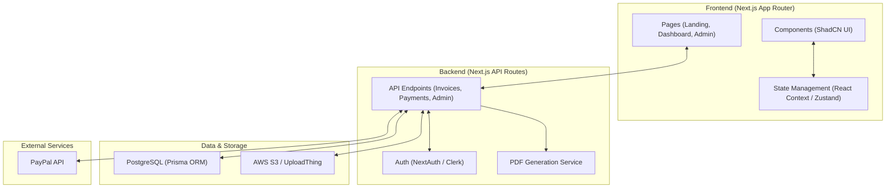
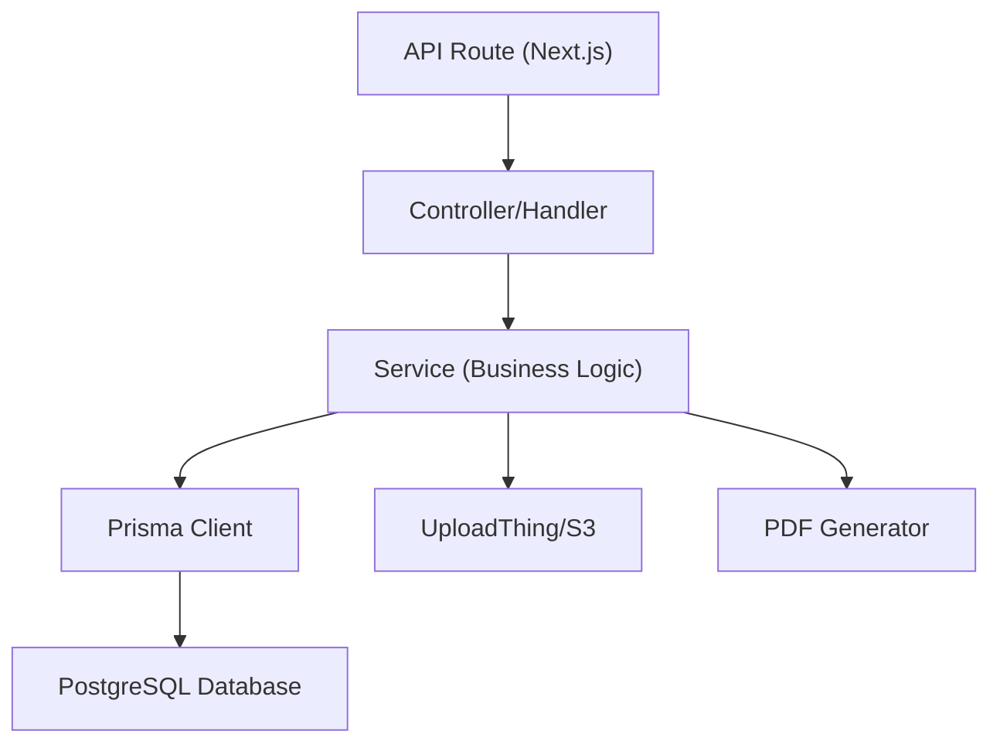
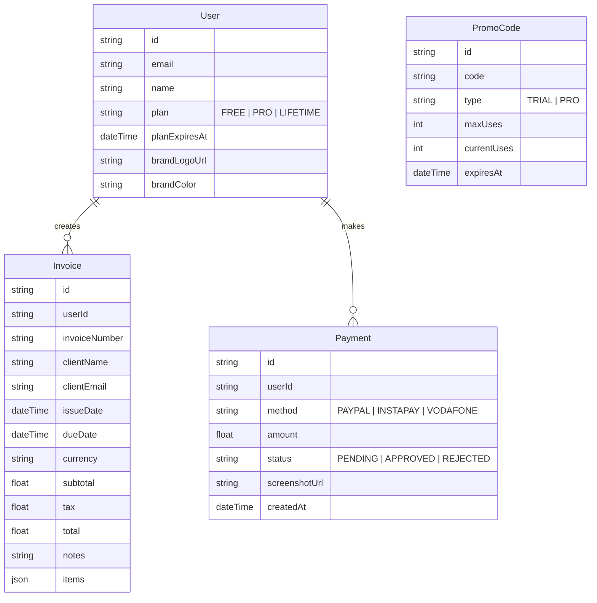

## 1. Architecture Design

## 2. Technology Description
- **Framework**: Next.js 14+ (App Router)
- **Styling**: Tailwind CSS + ShadCN UI
- **Database**: PostgreSQL
- **ORM**: Prisma
- **Authentication**: NextAuth.js (or Clerk)
- **File Storage**: UploadThing (for logos and payment screenshots)
- **PDF Generation**: Puppeteer / Playwright via serverless function, or a specialized library like `@react-pdf/renderer` for server-side PDF generation.
- **Payments**: PayPal SDK + Custom Manual Verification Flow

## 3. Route Definitions
| Route | Purpose |
|-------|---------|
| `/` | Landing page |
| `/login`, `/register` | Authentication pages |
| `/dashboard` | Main user dashboard (list invoices) |
| `/dashboard/invoice/new` | Create new invoice |
| `/dashboard/invoice/[id]` | Edit existing invoice |
| `/dashboard/settings` | Branding, profile, billing, promo code redemption |
| `/dashboard/checkout` | Payment method selection and screenshot upload |
| `/admin` | Admin dashboard overview |
| `/admin/payments` | Manual payment approval queue |
| `/admin/promo-codes` | Promo code management |

## 4. API Definitions
- `POST /api/invoices`: Create a new invoice
- `GET /api/invoices`: List user's invoices
- `PUT /api/invoices/[id]`: Update invoice
- `DELETE /api/invoices/[id]`: Delete invoice
- `GET /api/invoices/[id]/pdf`: Generate and return PDF buffer
- `POST /api/payments/manual`: Submit InstaPay/Vodafone Cash screenshot
- `POST /api/payments/paypal/capture`: Capture PayPal order
- `POST /api/admin/payments/[id]/approve`: Approve manual payment
- `POST /api/promo/redeem`: Validate and apply promo code

## 5. Server Architecture Diagram

## 6. Data Model
### 6.1 Data Model Definition

